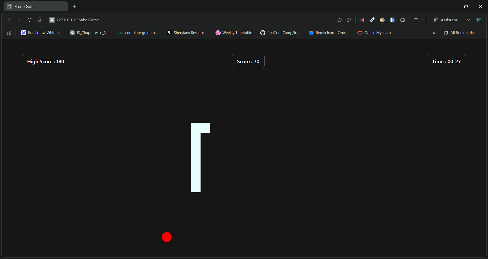

# 🐍 Snake Game

A modern, responsive, and customizable **Snake Game** built using **HTML, CSS, and JavaScript**.
Features difficulty modes, timer, high-score saving, touch controls for mobile, and clean UI.

---

## 📸 Preview



---

## 🎮 Live Demo

👉 **Play Now:** [https://dileep-kumawat.github.io/snake-game-using-html-css-and-js/](https://dileep-kumawat.github.io/snake-game-using-html-css-and-js/)

---

## 🎥 Demo Video

Watch the gameplay demo:
➡️ [click to watch](https://youtu.be/G53fjU_HlgI)

---

## 🚀 Features

* 🎚️ **Difficulty Modes** - Easy, Medium, Hard
* 💾 **High Score Persistence** (saved in localStorage)
* ⏱️ **Game Timer**
* 🍎 **Random Food Generator**
* 📱 **Touch Controls for Mobile**
* 🎨 Clean, modern UI
* ⚡ Smooth Movement & Collision Detection

---

## 🧩 Technologies Used

* **HTML5**
* **CSS3**

  * Responsive grid layout
  * Mobile-friendly controls
* **JavaScript (Vanilla)**

  * Dynamic game rendering
  * Grid creation
  * Keyboard & touch controls
  * Score tracking
  * Timing system

---

## 📂 Project Structure

```
📁 Snake-Game
├── index.html      # Game UI markup
├── style.css       # Styling and responsiveness
└── script.js       # Game logic & controls
```

---

## 🛠️ How to Run Locally

1. **Download or Clone the repository**

   ```bash
   git clone https://github.com/Dileep-kumawat/snake-game-using-html-css-and-js.git
   ```
2. **Open index.html in any browser**

   * No server needed
   * Works offline

---

## 🕹️ Controls

### **Desktop**

| Key            | Action     |
| -------------- | ---------- |
| ⬆️ Arrow Up    | Move Up    |
| ⬇️ Arrow Down  | Move Down  |
| ⬅️ Arrow Left  | Move Left  |
| ➡️ Arrow Right | Move Right |

### **Mobile**

✔️ On-screen directional buttons (auto enabled)

---

## 📈 High Score System

* Saved automatically in the browser
* Updates whenever you set a new high score
* Stored using `localStorage`

---

## 🧠 Game Logic Highlights

* Grid is created dynamically based on container size
* Snake movement is calculated using head positions
* Collision detection includes:

  * Walls
  * Self-body
* When eating food:

  * Snake grows
  * Score increases
  * New food is created randomly

---

## 🧑‍💻 Author

**Dileep**
Made with 💖 & JavaScript.
- 📧 [dileepkumawat525@gmail.com](mailto:dileepkumawat525@gmail.com)
- 🔗 [LinkedIn](https://www.linkedin.com/in/dileep-kumawat/)

---

## ⭐ Support

If you like this project, don’t forget to **star the repo ⭐**!